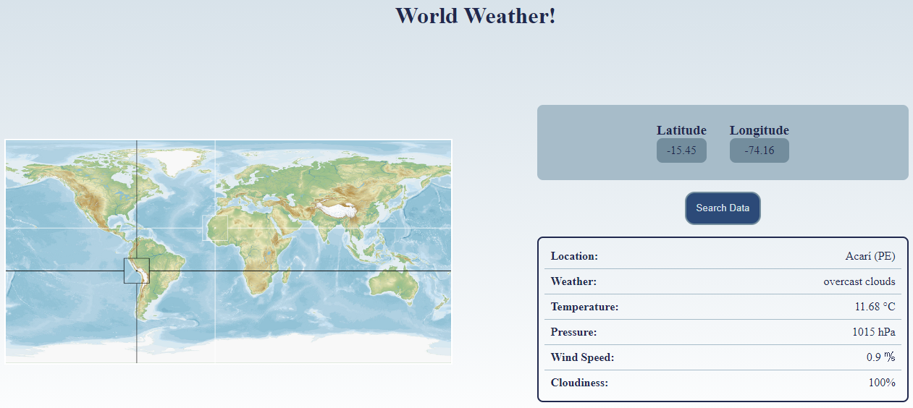

# Weather-JS
> English not my first language

Simple React JS app to get the weather around the world.

## Table of contents
- [Introduction](#introduction)
- [Technologies](#technologies)
- [Illustrations](#illustrations)
- [To-Do](#to-do)

## Introduction
This project is a practice for APIs using React JS. It's a simple where the user can click on the world map and check the weather in that location.

## Technologies
- NodeJS v15.8.0

## Illustrations

| WebSite |
|:---:|
||

## To-Do
- *\*Finished\**